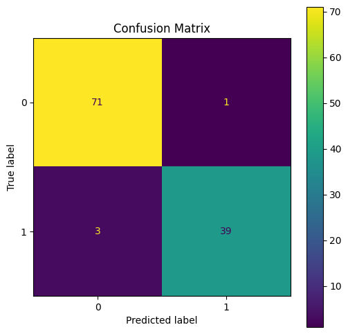
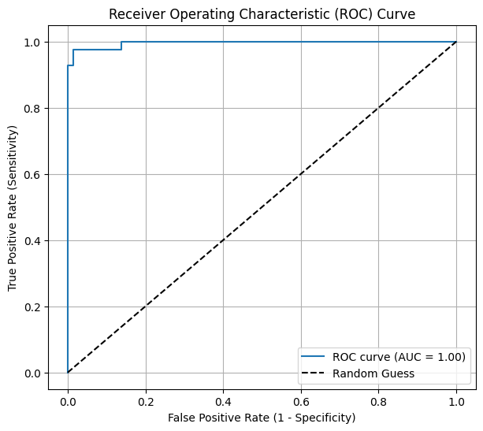

# Breast Cancer Classification using Logistic Regression

This project demonstrates a complete workflow for binary classification of breast cancer tumors as malignant or benign using logistic regression. It includes data preprocessing, model training, evaluation, ROC-AUC analysis, and threshold tuning.

[Download the Housing Price Dataset](https://www.kaggle.com/datasets/uciml/breast-cancer-wisconsin-data)

---

## Dataset

- File: `Breast-Cancer-Dataset.csv`
- Rows: 569
- Columns: 31 features + target
- Target: `diagnosis` (1 = malignant, 0 = benign)

---

## Steps Performed

### 1. Data Loading and Inspection
```
import pandas as pd

df = pd.read_csv('Breast-Cancer-Dataset.csv')
print(df.head())
print(df.info())
print(df['diagnosis'].value_counts())
```
*Loaded the dataset, checked data types, and class distribution.*

### 2. Data Cleaning
```
df = df.drop(['id', 'Unnamed: 32'], axis=1)
print(df.info())
```
*Removed ID and empty columns.*

### 3. Encoding Target Column
Encode diagnosis: M=1, B=0
```
df['diagnosis'] = df['diagnosis'].map({'M': 1, 'B': 0})
print(df['diagnosis'].value_counts())
```
*Converted target to numeric.*

[Updated Breat-Cancer-Dataset](Breast-Cancer-Cleaned.csv)

### 4. Train-Test Split and Scaling
```
from sklearn.model_selection import train_test_split
from sklearn.preprocessing import StandardScaler

X = df.drop('diagnosis', axis=1)
y = df['diagnosis']

X_train, X_test, y_train, y_test = train_test_split(
X, y, test_size=0.2, random_state=42, stratify=y
)

scaler = StandardScaler()
X_train_scaled = scaler.fit_transform(X_train)
X_test_scaled = scaler.transform(X_test)
```
*Split data and standardized features.*

### 5. Model Training
```
from sklearn.linear_model import LogisticRegression

model = LogisticRegression(max_iter=1000, random_state=42)
model.fit(X_train_scaled, y_train)
```
*Trained logistic regression model.*

### 6. Model Evaluation
```
from sklearn.metrics import confusion_matrix, classification_report

y_pred = model.predict(X_test_scaled)

print(confusion_matrix(y_test, y_pred))
print(classification_report(y_test, y_pred))
```
*Evaluated model performance.*

### 7. Confusion Matrix Visualization and Report
```
import matplotlib.pyplot as plt
from sklearn.metrics import ConfusionMatrixDisplay

cm = confusion_matrix(y_test, y_pred)
disp = ConfusionMatrixDisplay(confusion_matrix=cm, display_labels=)
fig, ax = plt.subplots(figsize=(6, 6))
disp.plot(ax=ax)
plt.title('Confusion Matrix')
plt.show()
```


*Visualized confusion matrix.*

### 8. ROC Curve and AUC
```
from sklearn.metrics import roc_curve, roc_auc_score
import matplotlib.pyplot as plt

y_proba = model.predict_proba(X_test_scaled)[:, 1]

fpr, tpr, thresholds = roc_curve(y_test, y_proba)
auc = roc_auc_score(y_test, y_proba)

plt.figure(figsize=(7, 6))
plt.plot(fpr, tpr, label=f'ROC curve (AUC = {auc:.2f})')
plt.plot(, [0,k--', label='Random Guess')
plt.xlabel('False Positive Rate (1 - Specificity)')
plt.ylabel('True Positive Rate (Sensitivity)')
plt.title('Receiver Operating Characteristic (ROC) Curve')
plt.legend()
plt.grid()
plt.show()

print(f"AUC (Area Under Curve): {auc:.4f}")
```


*Analyzed model discrimination ability.*

### 9. Probability Threshold Tuning
```
threshold = 0.5
y_pred_custom = (y_proba >= threshold).astype(int)

print(f"Results for threshold = {threshold}:")
print(confusion_matrix(y_test, y_pred_custom))
print(classification_report(y_test, y_pred_custom))
```
*Explored different classification thresholds to balance recall and precision.*

---

## Key Insights

- The model achieves high accuracy (~96%) and excellent AUC (~0.996).
- Adjusting the classification threshold can improve recall for malignant cases, important in medical diagnosis.
- Confusion matrix and classification report provide detailed performance metrics.

---

## Conclusion

This project demonstrates a robust logistic regression classification workflow for breast cancer diagnosis, including data cleaning, encoding, modeling, evaluation, visualization, and threshold tuning.

---

**Author:** Saksham Bindal

